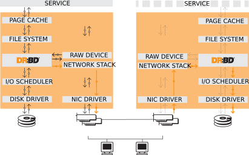

# 1. DRBD 概要

DRBD是一种基于软件的、无共享的、复制的存储解决方案，镜像主机之间的块设备（硬盘，分区，逻辑卷等）的内容。

DRBD镜像数据

* 实时。当应用程序修改设备上的数据时，复制会持续发生。
* 透明。应用程序不需要知道数据存储在多台主机上。
* 同步或异步。通过同步镜像，在所有（已连接）主机上执行写入之后，将通知应用程序的写入完成。通过异步镜像，当本地完成写入操作时，会将应用程序通知写入完成，这通常在传播到其他主机之前。

## 1.1 内核模块

DRBD的核心功能是通过Linux内核模块实现的。具体来说，DRBD构成虚拟块设备的驱动程序，因此DRBD位于系统I / O堆栈底部附近。正因为如此，DRBD非常灵活和通用，这使得它成为一种适合于为任何应用程序增加高可用性的复制解决方案。

根据定义，根据Linux内核架构的规定，DRBD与其上面的层不可知。因此，DRBD不可能奇迹般地将功能添加到这些不具有的上层。例如，DRBD无法自动检测文件系统损坏，或者为文件系统（如ext3或XFS）添加主动 - 主动集群功能。

图1.1。 DRBD在Linux I / O堆栈中的地位

## 1.2 用户管理工具

DRBD附带一套与内核模块通信的管理工具，以配置和管理DRBD资源。从顶层到最底层都是：

**drbdmanage** 作为单独的项目提供，这是在多节点群集中编排DRBD资源的推荐方法。DRBD Manage使用一个DRBD 9资源来存储其群集范围的配置数据，并通过调用外部程序（如lvcreate和drbdadm），提供了一种快速简单的方式来执行最常用的管理任务。

有关详细信息，请参阅本文档中的DRBD管理条目。

**drbdadm** DRBD-utils程序套件的高级管理工具。从配置文件/etc/drbd.conf获取所有DRBD配置参数，并充当drbdsetup和drbdmeta的前端。drbdadm具有干运行模式，使用-d选项调用，显示drbdsetup和drbdmeta调用drbdadm将会发出而不实际调用这些命令。

**drbdsetup** 配置加载到内核中的DRBD模块。 drbdsetup的所有参数必须在命令行中传递。 drbdadm和drbdsetup之间的分离允许最大的灵活性。大多数用户很少需要直接使用drbdsetup，如果有的话。

**drbdmeta** 允许创建，转储，恢复和修改DRBD元数据结构。像drbdsetup一样，大多数用户很少需要直接使用drbdmeta。

## 1.3 资源

在DRBD中，*资源*(resource) 是指特定复制数据集的所有方面的集合术语。这些包括：

**资源名称**(Resource name) 这可以是任何不包含资源引用的空白的US-ASCII名称。

**卷**(Volumes) 任何资源都是由共享一个共同复制流的更多*卷*之一组成的复制组。 DRBD确保资源中所有卷的写保真度。卷从0开始编号，一个资源中可能有多达65,535个卷。卷从0开始编号，一个资源中可能有多达65,535个卷。卷包含复制数据集，以及DRBD内部使用的一组元数据。

>在drbdadm级别，资源中的卷可以通过资源名称和卷号作为资源/卷来寻址。

**DRBD设备**(DRBD device) 这是由DRBD管理的虚拟块设备。它的设备主要数量为147，其次要编号从0开始，按照惯例。每个DRBD设备对应于资源中的卷。相关的块设备通常命名为*/dev/drbdX*，其中*X*是设备次要号码。*udev*通常还将创建包含资源名称和卷号的符号链接，如*/dev/drbd/by-res/resource/vol-nr*中所示。

> 注意

> 很早的DRBD版本劫持了NBD的设备主要号码43.这是很长时间过时的; 147是LANANA注册的DRBD设备专业。

**连接**(Connection) *连接*是共享复制数据集的两台主机之间的通信链路。使用DRBD 9，可以在多台主机上定义每个资源;使用当前版本，这需要这些主机之间的全网状连接设置（即每个主机连接到该资源的每个其他主机）。

在drbdadm级别，资源和连接名称（后者默认为对等主机名）来解决连接，如*resource:connection*。

## 1.4 资源角色

在DRBD中，每个*资源*都有一个角色，可以是*主*或*从*。

> 注意

> 这里的术语的选择不是任意的。这些角色故意不被DRBD的创作者命名为“主”和“备”。*主*与*从*是指与存储可用性相关的概念，而*主*与*备*是指应用程序的可用性。在高可用性环境中，主节点通常也是活动节点，但这并不是必需的。

* 主角色的 DRBD 设备可以无限制地用于读写操作。它可用于创建和安装文件系统，将原始或直接 I/O 加载到块设备等。
* 从角色中的 DRBD 设备从对等节点的设备接收所有更新，但是否则不允许完全访问。它不能被应用程序使用，也不能用于读取或写入访问。不允许甚至只读访问设备的原因是维护缓存一致性的必要性，如果辅助资源以任何方式可访问，这将是不可能的。

资源的角色可以通过手动干预，或者通过集群管理应用程序的一些自动化算法自动更改。将资源角色从“从”改为“主”，称为*升级*，而反向操作则称为*降级*。
